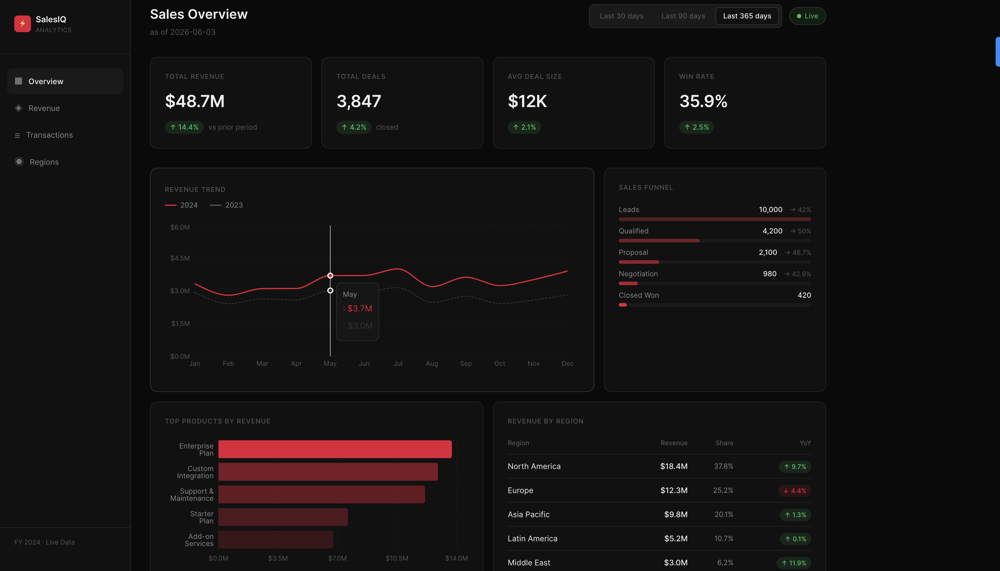

# Sales Intelligence Dashboard



A self-hosted sales analytics platform built to replace Tableau — featuring interactive dashboards, date range filtering, and CSV export.

> Built with Next.js 14, Django REST Framework, Docker, Kubernetes, and Jenkins CI/CD.

---

## Features

- **Overview dashboard** — KPI cards, revenue trend (YoY), sales funnel, region breakdown
- **Revenue page** — monthly/quarterly toggle, product-level breakdown with share bars
- **Regions page** — global revenue by region with YoY growth indicators
- **Transactions page** — paginated transaction table with status badges
- **Date range filter** — Last 30 / 90 / 365 days across all pages
- **CSV Export** — one-click download of filtered transactions

---

## Stack

| Layer     | Technology                                      |
|-----------|-------------------------------------------------|
| Frontend  | Next.js 14 (App Router), TypeScript, Recharts   |
| Backend   | Django 5, Django REST Framework                 |
| Infra     | Docker, Kubernetes, Jenkins CI/CD               |

---

## Project Structure

sales-dashboard/
├── frontend/
│   └── src/
│       ├── app/                  # Pages: /, /revenue, /regions, /transactions
│       ├── components/
│       │   ├── charts/           # RevenueTrendChart, TopProductsChart, SalesFunnel
│       │   ├── layout/           # Sidebar
│       │   └── ui/               # MetricCard, DateRangeFilter, ExportButton
│       └── lib/api.ts            # Typed API client
├── backend/
│   └── sales_dashboard/
│       └── api/v1/               # Views, URLs, mock data
├── k8s/                          # Kubernetes manifests
├── Jenkinsfile                   # CI/CD pipeline
└── docker-compose.yml            # Local dev

---

## API Endpoints

GET /api/v1/metrics/summary/?days=365
GET /api/v1/metrics/revenue-trend/?period=monthly&days=365
GET /api/v1/metrics/revenue-by-region/?days=365
GET /api/v1/metrics/top-products/?limit=5&days=365
GET /api/v1/metrics/sales-funnel/?days=365
GET /api/v1/transactions/?page=1&days=365
GET /api/v1/transactions/export/?days=365     # Returns CSV

---

## Local Development

```bash
# Backend
cd backend
python3 -m venv venv && source venv/bin/activate
pip install -r requirements.txt
python manage.py runserver

# Frontend (separate terminal)
cd frontend
npm install
npm run dev
```

Open [http://localhost:3000](http://localhost:3000)

---

## Deploy to Kubernetes

```bash
kubectl apply -f k8s/namespace.yaml
kubectl create secret generic backend-secrets \
  --from-literal=secret-key='your-real-secret' \
  -n sales-dashboard
kubectl apply -f k8s/backend-deployment.yaml
kubectl apply -f k8s/frontend-deployment.yaml
kubectl apply -f k8s/ingress.yaml
```

---

## CI/CD (Jenkins)

The `Jenkinsfile` defines a pipeline that:
1. Lints and tests both services
2. Builds Docker images tagged with the git commit SHA
3. Pushes to registry on `main` branch only
4. Rolls out to Kubernetes with zero-downtime `kubectl set image`

Configure `REGISTRY` and `KUBECONFIG_CRED` in `Jenkinsfile` before use.